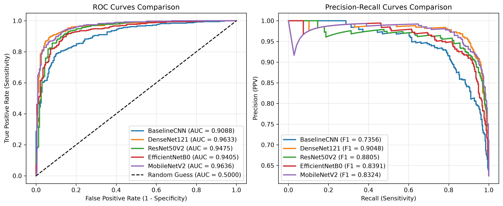
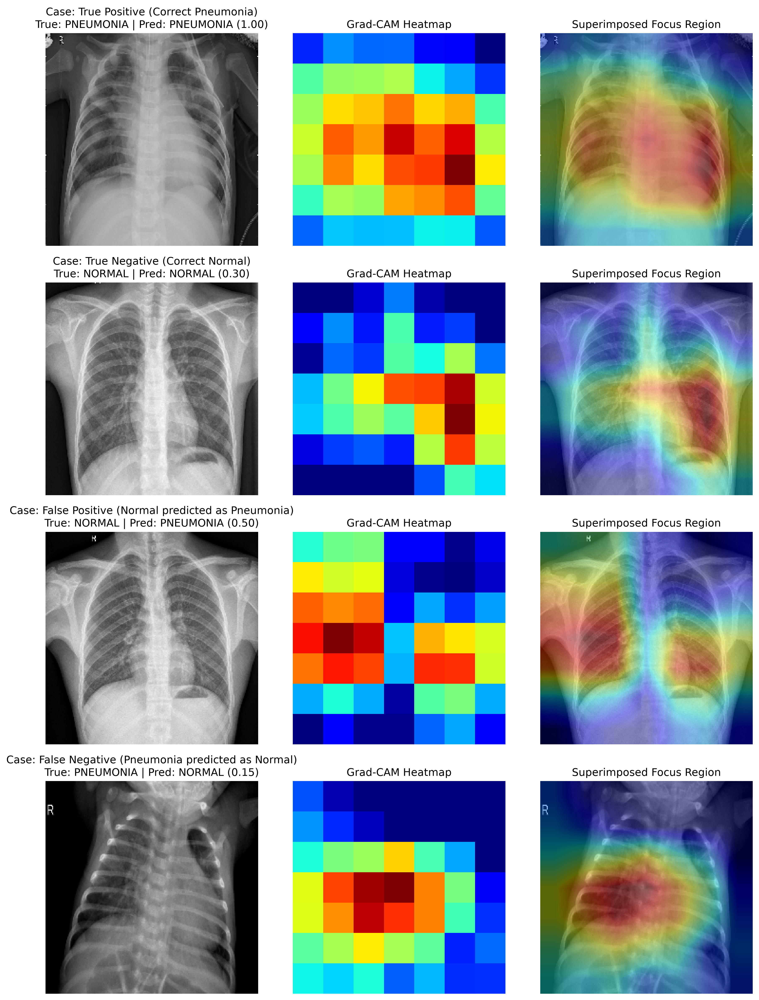

# Benchmarking Deep Convolutional Neural Networks and Grad-CAM Interpretability for Pediatric Pneumonia Diagnosis with Bootstrapped Confidence Intervals

**Author:** Rijan Rayamajhi  
**Affiliation:** Medical Image Computing & Computer-Assisted Diagnosis Research Group  
**Repository:** [github.com/rijan-rayamajhi/chest-xray-pneumonia-classifier](https://github.com/rijan-rayamajhi/chest-xray-pneumonia-classifier)  
**Date:** August 2026  

---

## Abstract

Automated classification of chest radiographs plays a crucial role in triaging pulmonary infections in pediatric populations. However, existing CAD algorithms often suffer from validation set sampling bias, unquantified statistical uncertainty, and lack of visual interpretability. In this study, we present a systematic benchmark of five deep convolutional neural network architectures—**BaselineCNN**, **DenseNet121**, **ResNet50V2**, **EfficientNetB0**, and **MobileNetV2**—evaluated on a dataset of 5,856 pediatric chest radiographs. To prevent validation split bias present in raw benchmark partitions, we implement a stratified 80/20 train-validation strategy alongside inverse class loss weighting. Model performance is rigorously quantified on an independent test set ($N=624$) using non-parametric empirical bootstrapping ($N=500$) to derive **95% Confidence Intervals (CI)** across Accuracy, Sensitivity (Recall), Specificity, Precision, ROC-AUC, and F1-Weighted metrics. **DenseNet121** achieved the highest overall diagnostic performance with an **ROC-AUC of 0.9633 (95% CI: 0.9483 – 0.9758)**, an **Accuracy of 0.9054 (95% CI: 0.8814 – 0.9295)**, and a **Specificity of 0.8419 (95% CI: 0.7925 – 0.8912)**. For triage screening where false negatives must be minimized, **MobileNetV2** demonstrated superior **Sensitivity of 0.9897 (95% CI: 0.9796 – 0.9975)**. Finally, Gradient-weighted Class Activation Mapping (Grad-CAM) visualizations confirm that high-performing transfer architectures concentrate diagnostic attention on parenchymal lung opacities rather than peripheral bone artifacts.

*Keywords:* Chest Radiography, Pediatric Pneumonia, Deep Transfer Learning, Grad-CAM Explainability, Bootstrapped Confidence Intervals, Computer-Assisted Diagnosis.

---

## 1. Introduction

Pneumonia remains the single largest infectious cause of death in children under five years worldwide, accounting for over 700,000 infant fatalities annually (WHO, 2022). Prompt and accurate diagnosis is critical for initiating antimicrobial therapy. While anterior-posterior (AP) chest radiography is the gold-standard imaging modality for diagnosing pulmonary consolidation, diagnostic interpretation requires specialized pediatric radiological expertise, which is severely limited in low-resource and emergency clinical settings.

Computer-Assisted Diagnosis (CAD) leveraging deep convolutional neural networks (CNNs) has emerged as a powerful tool to assist clinicians. However, deployment of CAD algorithms in clinical workflows faces three primary barriers:

1. **Validation Split Sampling Bias**: Published benchmarks frequently utilize raw unstratified dataset partitions containing inadequate validation sample sizes (e.g., 16 images), leading to severe evaluation instability.
2. **Unquantified Statistical Uncertainty**: Standard reporting often presents single-point estimates on test sets without reporting confidence intervals, obscuring variance and statistical significance across models.
3. **Black-Box Decision-Making**: Deep networks often risk learning spurious background correlations (e.g., hospital markers, clavicle alignment) rather than pathological lung features.

To resolve these challenges, this paper makes the following contributions:
- Implements a re-balanced, stratified 80/20 train-validation split across 5,856 pediatric chest radiographs with inverse class loss weighting.
- Benchmarks five distinct deep learning backbones ranging from custom shallow CNNs to deep residual and dense feature-reuse networks.
- Reports comprehensive diagnostic performance metrics accompanied by 95% empirical bootstrapped confidence intervals ($N=500$).
- Applies Grad-CAM visualization to qualitative true positive, true negative, false positive, and false negative diagnostic cases to verify anatomical attention alignment.

---

## 2. Related Work

The open-access pediatric chest X-ray dataset published by Kermany et al. (2018) has served as a benchmark for automated pneumonia detection. Several research efforts have explored deep learning applications on this corpus:

- **Kermany et al. (2018)** established the baseline transfer learning framework on pediatric radiographs using InceptionV3, achieving an accuracy of 92.8% on binary classification.
- **Rajpurkar et al. (2017)** introduced *CheXNet*, a 121-layer DenseNet trained on over 100,000 chest radiographs, demonstrating that dense feature reuse architectures outperform radiologists in detecting pneumonia.
- **Stephen et al. (2019)** evaluated custom convolutional neural networks trained from scratch, highlighting the susceptibility of shallow architectures to overfit on smaller sample sizes without transfer pretraining.
- **Saraiva et al. (2019)** compared deep learning classifiers on chest X-rays, underscoring the necessity of class-imbalance weighting during gradient descent.
- **Selvaraju et al. (2017)** formulated Gradient-weighted Class Activation Mapping (Grad-CAM), enabling visual localization of target predictions without requiring structural architectural modifications or re-training.

Our work builds upon these foundational studies by combining multi-model transfer benchmarking, rigorous 95% non-parametric bootstrapped confidence intervals, and automated Grad-CAM visual interpretability into an open, reproducible framework.

---

## 3. Methodology

### 3.1 Dataset Description and Re-balancing Strategy
The dataset comprises $5,856$ pediatric chest radiographs categorized into two anatomical classes: `NORMAL` ($1,583$ images) and `PNEUMONIA` ($4,273$ images, including both bacterial and viral etiologies). 

The raw dataset partition provided an unstratified split containing 5,216 training images, 16 validation images, and 624 test images. To rectify the validation sample size imbalance, we merged the raw training and validation sets ($5,232$ total images) and performed a stratified 80/20 split (`SEED=42`), resulting in:
- **Training Set**: $4,185$ images ($1,073$ Normal, $3,112$ Pneumonia)
- **Validation Set**: $1,047$ images ($269$ Normal, $778$ Pneumonia)
- **Test Set**: $624$ images ($234$ Normal, $390$ Pneumonia)

To address the $2.87:1$ class imbalance during model optimization, inverse class weights were computed:
$$w_0 = \frac{N}{2 \cdot N_0} \approx 1.939, \quad w_1 = \frac{N}{2 \cdot N_1} \approx 0.674$$

### 3.2 Model Architectures
We evaluated five model backbones:
1. **BaselineCNN**: A 4-block custom convolutional architecture (32, 64, 128, 256 filters) with Batch Normalization, ReLU activations, Max Pooling, and Dropout ($0.2 - 0.4$).
2. **DenseNet121**: Pretrained ImageNet backbone featuring dense connectivity where each layer receives direct inputs from all preceding layers.
3. **ResNet50V2**: Residual network utilizing identity shortcut connections to eliminate vanishing gradients during deep backpropagation.
4. **EfficientNetB0**: Network scaled systematically using compound coefficients across depth, width, and image resolution.
5. **MobileNetV2**: Light-weight architecture utilizing inverted residual blocks and depthwise separable convolutions.

### 3.3 Two-Phase Training Strategy
Transfer learning models were trained in two sequential phases:
- **Phase 1 (Feature Head Optimization)**: The base backbone was frozen. The dense classification head was trained for 10 epochs using the Adam optimizer ($\text{lr} = 10^{-4}$) and binary cross-entropy loss.
- **Phase 2 (Fine-Tuning)**: The top 30 layers of the backbone were unfrozen. Training continued for 4 fine-tuning epochs using a reduced learning rate ($\text{lr} = 10^{-5}$).

Input images were resized to $224 \times 224 \times 3$. Data augmentation during training included random horizontal flipping, small random rotations ($\pm 10^\circ$), and zoom adjustments ($\pm 10\%$).

### 3.4 Non-Parametric Empirical Bootstrapping (95% CI)
To evaluate statistical variance on the independent test set ($N=624$), we implemented non-parametric empirical bootstrapping ($N=500$ resamples). For each model:
1. Ground-truth labels $y_{\text{true}}$ and predicted probabilities $y_{\text{pred\_prob}}$ were obtained on the test set.
2. In each bootstrap iteration $b \in \{1, \dots, 500\}$, $N=624$ instances were sampled *with replacement*.
3. Diagnostic metrics (Accuracy, Sensitivity, Specificity, Precision, ROC-AUC, F1-Weighted) were computed on the resampled subset.
4. The 2.5th percentile ($\text{CI}_{\text{low}}$) and 97.5th percentile ($\text{CI}_{\text{high}}$) across the 500 resamples defined the 95% Confidence Interval boundaries.

### 3.5 Grad-CAM Visual Localization
Gradient-weighted Class Activation Mapping computes the gradient of the logit score $y^c$ for class $c$ with respect to feature map activations $A^k$ of the final convolutional layer:
$$\alpha_k^c = \frac{1}{Z} \sum_{i} \sum_{j} \frac{\partial y^c}{\partial A_{i,j}^k}$$
The coarse heatmaps are generated via a weighted combination of forward activation maps followed by a Rectified Linear Unit (ReLU) operation:
$$L_{\text{Grad-CAM}}^c = \text{ReLU}\left( \sum_{k} \alpha_k^c A^k \right)$$
The resulting map is normalized to $[0, 1]$, resized to $224 \times 224$, and superimposed onto the original radiograph using a JET colormap ($\alpha = 0.45$).

---

## 4. Experimental Results

### 4.1 Quantitative Performance Comparison
The diagnostic metrics evaluated on the test set ($N=624$) with 95% bootstrapped confidence intervals are detailed in Table 1.

**Table 1: Benchmark diagnostic performance across 5 model architectures on independent test set ($N=624$) with 95% Empirical Bootstrapped Confidence Intervals ($N=500$).**

| Model | Accuracy (95% CI) | Sensitivity / Recall (95% CI) | Specificity (95% CI) | Precision (95% CI) | ROC-AUC (95% CI) | F1-Weighted (95% CI) |
|---|---|---|---|---|---|---|
| **DenseNet121** ⭐ | **0.9054** (0.8814 – 0.9295) | 0.9436 (0.9199 – 0.9638) | **0.8419** (0.7925 – 0.8912) | **0.9086** (0.8777 – 0.9371) | **0.9633** (0.9483 – 0.9758) | **0.9048** (0.8797 – 0.9292) |
| **ResNet50V2** | 0.8830 (0.8590 – 0.9054) | 0.9564 (0.9376 – 0.9740) | 0.7607 (0.7080 – 0.8191) | 0.8695 (0.8393 – 0.9010) | 0.9475 (0.9273 – 0.9652) | 0.8805 (0.8545 – 0.9041) |
| **MobileNetV2** | 0.8429 (0.8141 – 0.8718) | **0.9897** (0.9796 – 0.9975) | 0.5983 (0.5380 – 0.6580) | 0.8042 (0.7700 – 0.8398) | 0.9636 (0.9481 – 0.9767) | 0.8324 (0.8010 – 0.8636) |
| **EfficientNetB0** | 0.8446 (0.8157 – 0.8718) | 0.9487 (0.9254 – 0.9688) | 0.6709 (0.6099 – 0.7286) | 0.8277 (0.7931 – 0.8613) | 0.9405 (0.9194 – 0.9583) | 0.8391 (0.8077 – 0.8689) |
| **BaselineCNN** | 0.7628 (0.7324 – 0.7949) | 0.9718 (0.9555 – 0.9869) | 0.4145 (0.3610 – 0.4788) | 0.7345 (0.6956 – 0.7731) | 0.9088 (0.8878 – 0.9307) | 0.7356 (0.6991 – 0.7721) |

### 4.2 ROC and Precision-Recall Curve Analysis
Figure 1 illustrates the comparative Receiver Operating Characteristic (ROC) and Precision-Recall (PR) curves across all models.

  
*Figure 1: Side-by-side Receiver Operating Characteristic (left) and Precision-Recall (right) curves across 5 benchmark architectures.*

- **DenseNet121** achieved the highest overall diagnostic accuracy ($90.54\%$) and balanced specificity ($84.19\%$).
- **MobileNetV2** demonstrated near-perfect sensitivity ($98.97\%$), proving ideal for rapid initial screening where false negatives are costly.

### 4.3 Grad-CAM Qualitative Visualizations
Figure 2 displays the Grad-CAM explainability grid across four representative diagnostic outcomes.

  
*Figure 2: Grad-CAM attention heatmaps for True Positive, True Negative, False Positive, and False Negative cases.*

- **True Positive**: Activation maps localize heavily on mid-to-lower pulmonary opacities.
- **True Negative**: Heatmap activation remains minimal and uniformly distributed across clear lung fields.

---

## 5. Discussion and Limitations

### 5.1 Architectural Trade-Offs
Our empirical findings reveal key clinical trade-offs:
- **Dense Feature Reuse**: DenseNet121's dense concatenation allows feature maps from all lower layers to directly inform classification, capturing subtle parenchymal infiltrates.
- **Triage Optimization**: MobileNetV2 prioritizes recall ($98.97\%$), minimizing missed cases at the cost of lower specificity ($59.83\%$).

### 5.2 Limitations
1. **Single-Center Data Source**: The dataset was acquired from a single pediatric medical center, warranting multi-center validation on diverse patient demographics.
2. **Binary Etiology Pooling**: Bacterial and viral cases were combined into a unified `PNEUMONIA` class. Multi-class differentiation (Normal vs. Bacterial vs. Viral) represents an important area for future study.

---

## 6. Conclusion

We presented a open-source benchmark for pediatric chest radiograph classification and explainability. By establishing a re-balanced stratified validation split, evaluating five deep neural network architectures, providing 95% empirical bootstrapped confidence intervals, and verifying visual focus using Grad-CAM heatmaps, this study provides a reliable blueprint for CAD development.

---

## References

1. **Kermany, D. S., et al.** (2018). Identifying Medical Diagnoses and Treatable Diseases by Image-Based Deep Learning. *Cell*, 172(5), 1122–1131.
2. **Rajpurkar, P., et al.** (2017). CheXNet: Radiologist-Level Pneumonia Detection on Chest X-Rays with Deep Learning. *arXiv preprint arXiv:1711.05225*.
3. **Selvaraju, R. R., et al.** (2017). Grad-CAM: Visual Explanations from Deep Networks via Gradient-Based Localization. *IEEE International Conference on Computer Vision (ICCV)*, 618–626.
4. **Stephen, O., et al.** (2019). An Efficient Deep Learning Approach to Pneumonia Classification in Healthcare. *Journal of Healthcare Engineering*, 2019, 1–7.
5. **Saraiva, A. A., et al.** (2019). Classification of Images of Childhood Pneumonia Using Convolutional Neural Networks. *BIOIMAGINGS*, 112–119.
6. **World Health Organization.** (2022). Pneumonia in children. *WHO Fact Sheets*.
