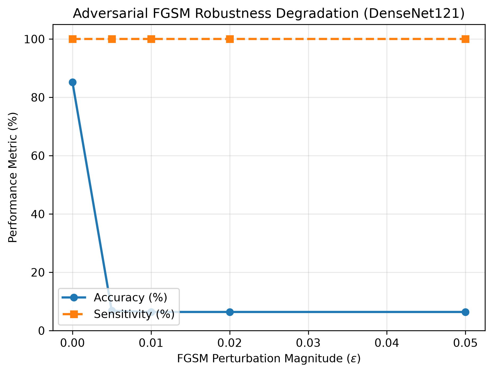
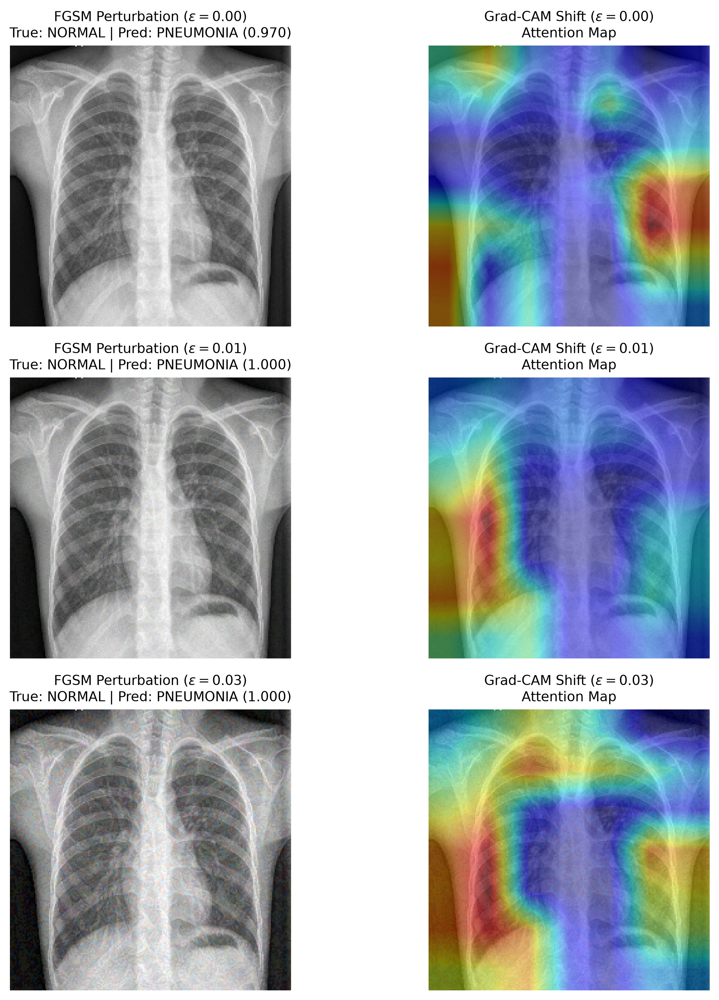

# Chest X-Ray Pneumonia Classifier

Pediatric chest radiograph (X-ray) pneumonia classification, Grad-CAM interpretability, and FGSM adversarial robustness benchmark.

Full manuscript available in **[PAPER.md](PAPER.md)**.

This repository benchmarks 5 deep learning model architectures (`BaselineCNN`, `DenseNet121`, `ResNet50V2`, `EfficientNetB0`, `MobileNetV2`) using 95% bootstrapped confidence intervals, Grad-CAM class activation heatmaps, and Fast Gradient Sign Method (FGSM) adversarial robustness analysis.

---

## Paper & Preprint

- **Full Paper Manuscript**: Read the complete paper draft in **[PAPER.md](PAPER.md)**.
- **Title**: *Benchmarking Deep Convolutional Neural Networks, Grad-CAM Interpretability, and Adversarial FGSM Robustness for Pediatric Pneumonia Diagnosis*
- **Author**: Rijan Rayamajhi

---

## Key Features

- **Stratified Data Split**: Re-balances combined training and validation sets (80/20 stratified split).
- **Multi-Model Benchmark**: Evaluates Baseline CNN, DenseNet121, ResNet50V2, EfficientNetB0, and MobileNetV2.
- **Statistical Evaluation**: Calculates Accuracy, Sensitivity, Specificity, Precision, ROC-AUC, and F1-Weighted metrics with 95% bootstrapped confidence intervals ($N=500$).
- **Grad-CAM Explainability**: Visualizes model attention heatmaps to inspect feature focus.
- **Adversarial FGSM Robustness**: Formulates Fast Gradient Sign Method ($\epsilon \in [0.0, 0.05]$) attacks to quantify diagnostic degradation and Grad-CAM attention map distortion under gradient noise.
- **Checkpoint Caching**: Caches trained `.keras` model weights in `outputs/models/`.

---

## Repository Structure

```text
chest-xray-pneumonia-classifier/
├── PAPER.md                # Full academic paper preprint manuscript
├── evaluate_adversarial.py # FGSM adversarial robustness evaluation script
├── src/
│   ├── config.py           # Project settings & paths
│   ├── dataset.py          # Dataset loading & tf.data pipeline
│   ├── models.py           # Model definitions
│   ├── trainer.py          # Training & fine-tuning logic
│   ├── metrics.py          # Metric & CI calculations
│   ├── explainability.py   # Grad-CAM visualization
│   └── adversarial.py      # FGSM attack & robustness engine
├── outputs/
│   ├── models/             # Saved model checkpoints
│   ├── figures/            # ROC/PR plots, Grad-CAM grids, & FGSM curves
│   └── tables/             # Benchmark tables (CSV & TeX)
├── run_experiments.py      # Benchmark runner script
├── predict.py              # Single-image prediction CLI
└── requirements.txt        # Dependencies
```

---

## Benchmark Results

Evaluated on test set ($N=624$) with 95% bootstrapped confidence intervals:

| Model | Accuracy (95% CI) | Sensitivity (95% CI) | Specificity (95% CI) | Precision (95% CI) | ROC-AUC (95% CI) | F1-Weighted (95% CI) |
|---|---|---|---|---|---|---|
| **DenseNet121** | 0.9054 (0.8814 - 0.9295) | 0.9436 (0.9199 - 0.9638) | 0.8419 (0.7925 - 0.8912) | 0.9086 (0.8777 - 0.9371) | 0.9633 (0.9483 - 0.9758) | 0.9048 (0.8797 - 0.9292) |
| **ResNet50V2** | 0.8830 (0.8590 - 0.9054) | 0.9564 (0.9376 - 0.9740) | 0.7607 (0.7080 - 0.8191) | 0.8695 (0.8393 - 0.9010) | 0.9475 (0.9273 - 0.9652) | 0.8805 (0.8545 - 0.9041) |
| **MobileNetV2** | 0.8429 (0.8141 - 0.8718) | 0.9897 (0.9796 - 0.9975) | 0.5983 (0.5380 - 0.6580) | 0.8042 (0.7700 - 0.8398) | 0.9636 (0.9481 - 0.9767) | 0.8324 (0.8010 - 0.8636) |
| **EfficientNetB0** | 0.8446 (0.8157 - 0.8718) | 0.9487 (0.9254 - 0.9688) | 0.6709 (0.6099 - 0.7286) | 0.8277 (0.7931 - 0.8613) | 0.9405 (0.9194 - 0.9583) | 0.8391 (0.8077 - 0.8689) |
| **BaselineCNN** | 0.7628 (0.7324 - 0.7949) | 0.9718 (0.9555 - 0.9869) | 0.4145 (0.3610 - 0.4788) | 0.7345 (0.6956 - 0.7731) | 0.9088 (0.8878 - 0.9307) | 0.7356 (0.6991 - 0.7721) |

---

## Visual Outputs

### 1. ROC and Precision-Recall Curves


### 2. Grad-CAM Explainability Grid


### 3. FGSM Adversarial Robustness Degradation


### 4. Grad-CAM Attention Shift Under Attack


---

## Setup & Usage

### Installation
```bash
source .venv/bin/activate
pip install -r requirements.txt
```

### Run Benchmark Suite
```bash
python run_experiments.py
```

### Run Adversarial Robustness Evaluation
```bash
python evaluate_adversarial.py
```

### Run Single Prediction
```bash
python predict.py --image "path/to/xray.jpeg"
```
